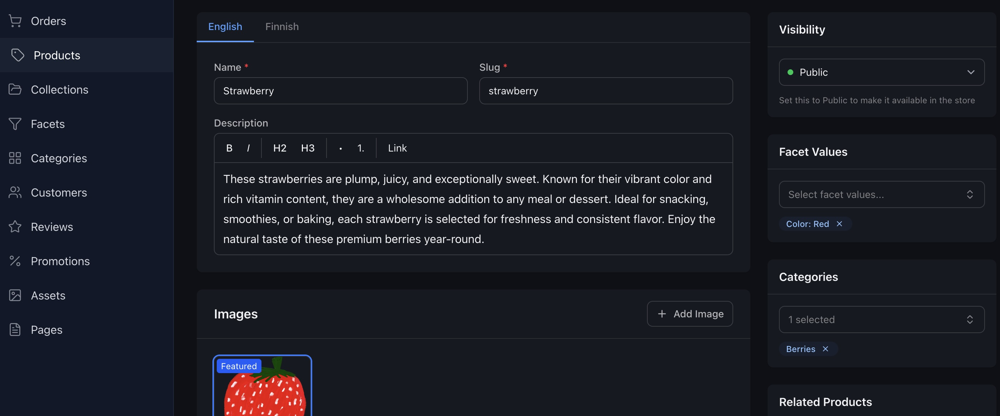

# Hoikka

[](LICENSE) [](https://svelte.dev) [](https://orm.drizzle.team) [](https://neon.tech) [](https://vercel.com)



[Hoikka](https://hoikka.dev) is an opinionated, full-stack e-commerce platform built with SvelteKit.

It includes the storefront, admin panel, API, and business logic in a single lightweight codebase and is ready to deploy serverless.

## Philosophy: Code Over Configuration

Hoikka follows the principles of the [Rails Doctrine](https://rubyonrails.org/doctrine), favoring clarity, strong defaults, and real application code over abstraction layers.

There are no plugin systems, configuration DSLs, or hidden admin logic. Everything is plain TypeScript that you can read, change, and extend directly.

This also makes Hoikka well-suited for AI-assisted development: the codebase is structured so that both humans and AI agents can reason about it easily.

## Features

- [Products & Variants](https://hoikka-docs.vercel.app/features/products): multiple variants per product with independent pricing, inventory, and images
- [Full-Text Search](https://hoikka-docs.vercel.app/features/search): client-side product cache with instant filtering, faceted search, and pagination
- [Smart Collections](https://hoikka-docs.vercel.app/features/collections): rule-based product grouping by facets, price, stock, or manual selection
- [Categories](https://hoikka-docs.vercel.app/features/categories): hierarchical category tree with breadcrumb navigation
- [Promotions](https://hoikka-docs.vercel.app/features/promotions): percentage and fixed discounts, coupon codes, automatic promotions, per-group and per-product targeting
- [B2B Pricing](https://hoikka-docs.vercel.app/features/b2b): customer groups with group-specific variant prices and tax exemptions
- [Inventory](https://hoikka-docs.vercel.app/features/inventory): stock tracking with timed reservations to prevent overselling
- [Orders & Checkout](https://hoikka-docs.vercel.app/features/orders): full checkout flow with guest and registered customer support
- [Payments](https://hoikka-docs.vercel.app/features/payments): pluggable payment methods (Stripe ready)
- [Shipping](https://hoikka-docs.vercel.app/features/shipping): configurable shipping methods with tracking
- [Tax](https://hoikka-docs.vercel.app/features/tax): VAT calculation with multiple rates per product type
- [Wishlists](https://hoikka-docs.vercel.app/features/wishlists): for both logged-in and guest users
- [Reviews](https://hoikka-docs.vercel.app/features/reviews): customer ratings with moderation and verified purchase badges
- [Content Pages](https://hoikka-docs.vercel.app/features/content-pages): static pages for policies, FAQs, and more
- [Multi-Language](https://hoikka-docs.vercel.app/features/translations): translation tables for products, categories, collections, facets, and pages
- [Asset Management](https://hoikka-docs.vercel.app/features/assets): media library with focal point cropping
- [Integrations](https://hoikka-docs.vercel.app/integrations/overview): scheduled tasks, sync runner for ERP/PIM, webhooks with signature verification

## Quick Start

[](https://vercel.com/new/clone?repository-url=https%3A%2F%2Fgithub.com%2Fmhernesniemi%2Fsvelte-ecomm&project-name=hoikka&repository-name=hoikka&stores=%5B%7B%22type%22%3A%22integration%22%2C%22productSlug%22%3A%22neon%22%2C%22integrationSlug%22%3A%22neon%22%7D%2C%7B%22type%22%3A%22blob%22%7D%5D&skippable-integrations=1)

This provisions a Neon Postgres database and Vercel Blob storage automatically. After deploying, enable Neon Auth in your [Neon Console](https://console.neon.tech) and add the auth environment variables to your Vercel project.

### Local Development

```bash
# Clone your new repository and install dependencies
git clone <your-repo>
cd hoikka
bun install

# Link to your Vercel project and pull environment variables
npx vercel link
npx vercel env pull .env.local

# Run migrations and start dev server
bun run db:migrate
bun run dev
```

Or follow the full [installation instructions](https://hoikka-docs.vercel.app/getting-started/installation).

## Docs

You can find the full documentation at [Hoikka Docs](https://hoikka-docs.vercel.app).
